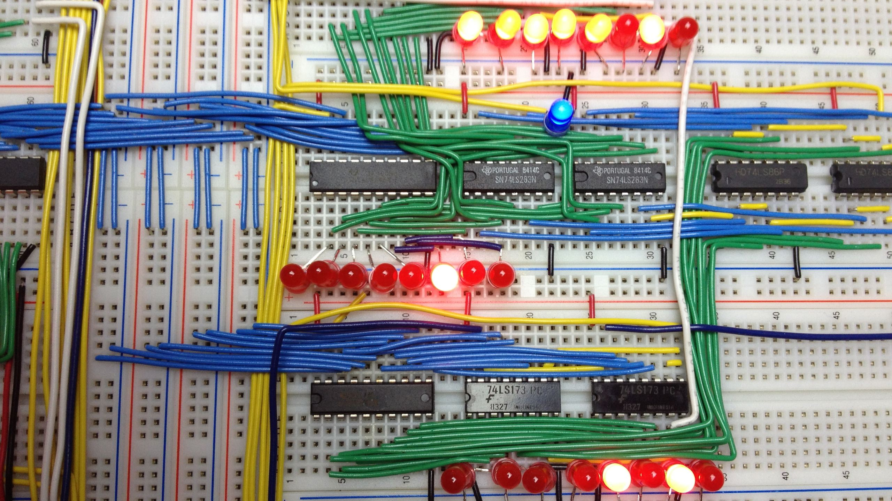

%SAP-2S: Two Sigma Builds an 8 Bit Computer
%Rachel Malbin, Jay Smith, Daniel , Chris Mulligan, and Trammell Hudson
%Fall 2017

\

In the fall of 2017 a group of TSers are going to follow Ben Eater's ([https://eater.net/](https://eater.net/)) YouTube guide to building a variant of the SAP-1 8 bit computer on breadboards. The SAP-1's full name is Simple As Possible-1, from the 1970s era text book [Digital Computer Electronics](http://a.co/3G7b9Mz) by Malvino & Brown. 

We'll be tweaking and improving it slightly, so our version will be called the SAP-2S. 

The computer will be built primarily using 1970s era TTL Integrated Circuits, the [classic 7400 series](https://en.wikipedia.org/wiki/7400_series), specifically the 74LS series, Low-power Schottky variant. These chips have a typical 10 ns gate delay, and a remarkable-for-the-time 2 mW dissipation, using 5 volts.

The computer is composed of several modules, each of which performs just a few basic functions. These modules can be built and tested separately, and then assembled together.

* Clock module (CLK)
* Registers (A, B, IR)
* Arithmetic and logic unit (ALU)
* Random access memory (RAM)
* Program counter (PC)
* Output (OUT)
* Bringing it all together (BUS)
* Control logic (CONT)

# Conventions

In order to follow Ben's videos, and enable easier assembly, we'll be following certain conventions across all the modules. 

* Wire colors:
    * $\color{red}\textsf{\textbf{Red}}$ is 5V (Vcc)
    * $\textsf{\textbf{Black}}$ is ground (GND)
    * $\color[rgb]{.4, .4, .4}\textsf{White}$  is clock (CLK)
    * $\color[rgb]{.9, .9, 0}\textsf{\textbf{Yellow}}$ (yellow) is control, eg write enable WE, load LD, etc (CONT)
    * $\color{blue}\textsf{\textbf{Blue}}$ is data, particularly data going to/from the bus (BUS)
    * $\color[rgb]{.25, .5, 0}\textsf{\textbf{Green}}$ is internal wiring within a module
    * $\color[rgb]{1, .5, 0}\textsf{\textbf{Orange}}$ is typically manual control/settings, particularly during testing
    * $\color[rgb]{.64, .18, .18}\textsf{\textbf{Brown}}$ is clear and reset (CLR)
    
* Row 1 should always be on the left of the breadboard
* Pin 1 should always be on the bottom left, with the notch to the left
* For final assembly, breadboards should remove the *BOTTOM* bus bar, and keep the top
* The LSB is on the right, when possible. 

# Changes we're making
We're tweaking the system Ben built slightly to make it a little more powerful, and a little more fun for demoing. Many folks have done these extensions, such as [LoneRegister](https://www.youtube.com/watch?v=PieFUmjG0do) with extra RAM and instructions. 

## Reset Button

Ben often finds it helpful to reset his system, but it's all spread around. In (https://youtu.be/HtFro0UKqkk)[https://youtu.be/HtFro0UKqkk] Ben setups a reset button near the instruction register. 

## 64k SRAM chip
The RAM chips that Ben used isn't readily available, is very weird, and has very limited capacity. Instead, let's try a slightly fancier IDT7164 64k CMOS SRAM chip. We won't use most of that, but we'll use 256 bytes, or 2k.

It directly has tri-state output and is a single chip, so it should be much simpler. 

Changes:

* We don't need the 74LS04 inverters
* The IDT7164 SRAM uses the same pins for Data in and Data Out, so it only has a single bus input/output. 

## 8 bit memory addresses
One big limitation in Ben's system is the memory addresses are limited to just 4 bits. Which limits the computer to only 16 possible memory locations! Oh no!

We're going to build our system to use 8 bit memory addresses. That gives us access to a *massive* 256 locations. This requires a few changes:

Changes:

1. The Program Counter (PC) needs to be an 8 bit register/counter. That means cascading two 74LS161 together, and connecting all 8 bits to the bus.
2. The Memory Address Register needs to be a full 8 bits.
3. The Memory Address DIP switch should be 8 bits
4. The instruction set will change slightly, with memory addresses stored as a separate word in memory. So the code to load from memory address 0xAB, would be two bytes. The first byte would be the LDA instruction, and the following byte would be 0xAB. That means we need to add an fetch cycle from ROM into Memory Address Register, and advance the PC again.

## ROM programs
The computer Ben builds could be called a full [Von Neumann architecture](https://en.wikipedia.org/wiki/Von_Neumann_architecture), where instructions are stored in RAM. While this is powerful and flexible, and how modern computers work, unfortunately, that makes it a little more difficult to run programs. Every time the computer loses power the programs have been lost. So we need to either re-program them by hand after each boot (like Ben), find a way to load RAM with data on each boot (how modern computers work) like [an Arduino programmer](https://create.arduino.cc/projecthub/david-hansel/breadboard-computer-programmer-1e7a09?ref=user&ref_id=149803&offset=0), or fetch instructions from non-volatile memory like an EEPROM. Let's do the latter, turning the RAM module into a RAM/ROM module.

We'll have the ROM chip share a lot of the functionality with the RAM chip, particularly the Memory Address Register, but we'll allow the computer to choose whether to read from RAM or ROM. 

Changes:

1. Add a ROM chip to the RAM breadboard, and connect its IO to the bus. 
    * We may still want a 74LS245 tri-state output buffer so we can put LEDs on the ROM chip. 
2. Use the (now 8 bit) Memory Access Register as the address for the ROM chip.
3. Create a new control signal (DO for ROM **D**isk **O**ut? PO for **P**rogram **O**ut? EO for **E**EPROM **O**ut?) to output the contents of ROM memory onto the bus. 
4. Add that control line to the micro code EEPROMs
5. (Optionally?) Add an instruction for read ROM into register A. 
6. (Optionally?) Add physical DIP switches for the higher order addresses in the RAM chip -- this would let a user select from multiple programs in the EEPROM. 

## 8 microcode steps
This is a small change, but Ben resets his opcode (T) clock after just 6 steps. We'll be needing an extra clock cycle to fetch the extra argument from RAM, so since we don't care about performance, let's go a full 8 steps, in case we want to make more complicated instructions.

Changes:

1) Skip the reset part of the control logic, where he short circuits the counter.
2) Add T7 and T8 LEDs

# Future Work

### Assembler
We could write a nice simple assembler. Perhaps in Arduino, or perhaps in something like Python. Then folks can fully code in a nice machine language.

### Hex output
It wouldn't be too hard to add a Hex mode output to the output EEPROM, in addition to unsigned and twos-complement modes. 

### Full ALU
The SAP-1 that Ben implements doesn't perform any logic functions besides adding. For example, we can't do comparison, which means we can't have branches and if statements and such. We could replace the two 4 bit adders with the 74LS181 4-bit ALU. It provides:

>Provides 16 arithmetic operations: add, subtract, compare, double, plus twelve other arithmetic operations.
>Provides all 16 logic operations of two variables: exclusive-OR, compare, AND, NAND, OR, NOR, plus ten other logic operations.

This would likely require adding 4 additional control lines, and an additional controller EEPROM to control them (and perhaps require changing how the EEPROMs are coded, since 20 bits is an awkward number). It would also require additional instructions to actually use those functions, which means we'd (possibly) need to expand to 6 or 8 bit instructions.

### 6 bit instructions
Perhaps we want to be able to use more than 16 instructions. Let's figure that 64 is enough though, so we'll make our instructions into 6 bits, leaving 2 bits left for in-instruction immediates. While that's not much for immediates, it does let us have the three most useful binary numbers in the same instruction: 0, 1, or 2. We can always make two versions of the "immediates" commands, where one version really loads from the next byte of ROM.  

### ASCII Output
YouTuber [Ptrk25](https://youtu.be/odEIWwqJOI4) added a new module to theirs that takes the output value and decodes it as ASCII, printing it out and letting you build up a message character by character (ie keeping state). I imagine it uses a full microcontroller (arduino?) to capture the values when told, and then drive the LCD. 

Again, for the CPU this would likely require more control lines and another control EEPROM to handle the control logic. 

# Schematics
Following this introduction are a set of schematics drawn by [Vincent Sanders aka kyllikki](https://github.com/kyllikki/eda-designs/tree/master/SAP-BE). These schematics may be helpful in assembling the various components. 

# Datasheets
Following those schematics are datasheets for all the components we'll be using. 